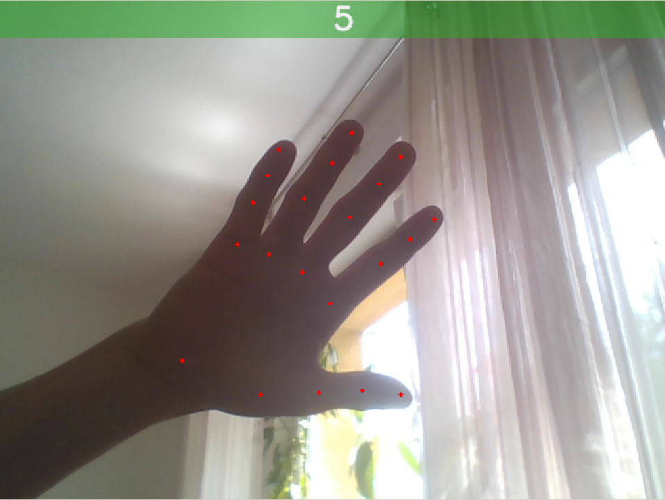

# Gesture recognition system
Author: Ladislav Ondris

This project performs gesture recognition from depth or color images. 
It consists mostly of hand detection, hand pose estimation, and gesture classification.


## Prerequisites

Python 3.7.10  

* Intel RealSense SR305 depth camera,
* or any color camera


## Installation

Install the required packages with:  
```
pip install -r requirements.txt
```

In case TensorFlow has a wrong dependency of gast, which may result in warning
or error messages, install 0.3.3 version of gast, which downgrades the package from version 0.4.0.

```
pip install gast==0.3.3
```

## Usage examples

The system requires that the user defines the gesture to be recognized, which
is described in Section *Preparation of gesture database*. For demonstration purposes,
the gesture database is already prepared for both color and depth images.  

The usage of the real-time recognition from live images is shown in 
*Real-time gesture recognition*.

### Real-time gesture recognition

**For demonstration**, the directory of the gesture database
named `color` is already present,
containing several representative gestures.

Start the gesture recognition system using gesture database stored in 
the `color` directory using the following command. Note that a color camera 
is required as the primary camera source (a web camera is sufficient). 

```
python3 recognize.py color
```

The following images showcase the system's display:  

<p float="left">
    
    
    
</p>

Appropriate coordinate predictor (color or depth) is selected depending on the selected image source.


### Gesture Recognition on Verca

**For demonstration**, the repository contains a video named `color_gestures.avi`.
This recording can be used to test the gesture recognition on Verca.

Make sure to do the following steps before running the actual example:
* Set up a virtual environment (see the steps below)
* Copy the repository to Verca—especially `recognize.py`, `color_gestures.avi`, `src`
  and `datasets/usecase/color` directories 

Run the following command to recognize gestures in the video and print the recognized
gestures to the standard output:
```
python3 recognize.py color --source video --video color_gestures.avi --display stdout
```

It runs on CPU and takes about **95 ms** to process a single frame on Verca as opposed to 10 ms on my laptop.
Use `--measure-time` to print the elapsed time for each frame to stdout.

#### Setting up a virtual environment

Setting up a virtual environment might require downloading packages using pip.
Make sure the Verca has access to the internet.

Create a new directory:
```
mkdir hands && cd hands
```
Create a virtual environment:
```
python -m venv ./
```
Install the required packages:
```
./bin/pip install --trusted-host pypi.org --trusted-host pypi.python.org --trusted-host files.pythonhosted.org numpy scikit-learn scikit-image opencv-python-headless protobuf==3.20.*
```

It is possible that some further tweaking with packages may be required.


### Preparation of gesture database

Beware: the preparation of gesture database requires either a depth or color camera. 
You can **skip this section** because there is already a database 
called `color` and `depth` available. Both databases contain six gestures—numbers 0 through 5.

The database scanner uses predictor of hand keypoints to determine the 
position of parts of a hand in space. Then, it writes the 3D coordinates
in a file to the `datasets/usecase/` directory. The captured poses then 
serve as representatives of that gesture.
The database is then used by `live_gesture_recognizer.py`.

To capture a gesture with label `1` into a `gesturesdb` directory with a scan
period of one second and SR305 camera:  
```
python3 scan_database.py gesturesdb 1 10 --camera SR305
```

To capture a gesture with label `hi` into a `colordb` directory with a scan 
period of one second and color camera:
```
python3 scan_database.py colordb hi 10
```

```
usage: scan_database.py [-h] [--scan-period SCAN_PERIOD] [--camera CAMERA]
                        [--hide-plot]
                        directory label count
positional arguments:
  directory             the name of the directory that should contain the
                        user-captured gesture database
  label                 the label of the gesture that is to be captured
  count                 the number of samples to scan
optional arguments:
  -h, --help            show this help message and exit
  --scan-period SCAN_PERIOD
                        intervals between each capture in seconds (default: 1)
  --camera CAMERA       the camera model in use for live capture (default:
                        None -> VideoCapture(0) is selected)
  --hide-plot           hide plots of the captured poses - not recommended
```

## System architecture

The system is designed from several components. Each component inherits from a base class,
which defines its interface. The abstract classes are defined in `system/components/base.py`.
This allows easy changes of implementations of components.

The components are:
* ImageSource
* CoordinatePredictor
  * Detector
  * Estimator
* GestureRecognizer
* Display

Implementations of these classes can be found in `system/components` in their corresponding folders.
The specific implementations are discussed below.

### ImageSource implementations

ImageSource is a component whose goal is to provide images as np.ndarray. 
For example, it can read images from a camera or files. The repository 
contains two image sources—DefaultVideoCaptureSource
and RealSenseCameraWrapper—both providing
camera frames.

#### DefaultVideoCaptureSource

DefaultVideoCaptureSource reads frames from the primary camera source.
It is a good option when using **color** cameras.

#### RealSenseCameraWrapper
RealSenseCameraWrapper wraps **depth** and **color (infrared)** image streams
as image sources from Intel RealSense cameras.

#### VideoImageSource

Reads image frames from a recording.


### CoordinatePredictor solutions

Coordinate predictors, given an image, return a set of 3D coordinates, specifying the 
precise position of the hand in space. The repository contains two solutions—color-based and depth-based.

#### Color-based

Uses **Mediapipe** hands solution from Google (https://google.github.io/mediapipe/solutions/hands.html).
The implementation class is named `MediapipeCoordinatePredictor`.

#### Depth-based

Uses custom-trained networks—**Blazeface** hand detector, and **Blazepose** hand pose estimator.
The implementation is located in the `TrackingCoordinatePredictor` class. Both models are written in
TensorFlow.

This solution could also be adapted for color-based tracking, but it might require a few
tweaks in the architecture or network configs. Also, new datasets would have to be acquired,
and the models would have to be trained from scratch on those datasets. That said, the Mediapipe solution
currently provides results above expectations.


### GestureRecognizer implementations

Two ready-to-use gesture recognizers are located in `src/system/components/gesture_recognizers` directory.

#### RelativeDistanceGestureRecognizer
`RelativeDistanceGestureRecognizer` was 
created as the first gesture recognizer. It requires proper setting of thresholds.

#### MLPGestureRecognizer
`MLPGestureRecognizer` is a classifier that uses a MLP to classify gestures.
The MLPGestureRecognizer is the preferred way of gesture
recognition for higher accuracy. That said, from its nature it can't
provide any feedback on which fingers are wrongly placed.

#### Other gesture-recognition related code

Other gesture-recognition related code is located in the
`src/gestures` directory.

`visualization.py`
* Captured gesture database can be visualized using t-SNE or 
LDA, which shows that clusters of the same gestures can be easily separated 
and, thus, classified as the correct class. 


<p float="left">
    
    
</p>

`sklearn_classifiers.py`
* One can use any classifier from the sklearn library.
This script evaluates many classifiers from sklearn
library to determine,
which performs best on the given captured gestures.

```
python3 sklearn_classifiers.py
```
prints:
```
Nearest Neighbors: 0.98
Linear SVM: 0.69
RBF SVM: 0.98
Gaussian Process: 1.0
Decision Tree: 1.0
Random Forest: 1.0
MLP: 1.0
AdaBoost: 0.5
Naive Bayes: 0.99
QDA: 1.0
```

Change the name of the gesture database in code to evaluate classifiers on a different gesture database.

### Display implementations

#### Empty display
`EmptyDisplay` is an empty implementation of the abstract class. It can be used
if no results are wanted to be displayed.


```
python3 recognize.py color --display empty
```

#### Stdout display
`StdoutDisplay` prints the recognized gesture to standard output.

```
python3 recognize.py color --display stdout
```

<p float="left">
    
</p>

#### Opencv display
`OpencvDisplay` supports plotting the image, together with a label of the recognized gesture.
It can also display a rectangle as the result of hand detection or the specific keypoints.

```
python3 recognize.py color --display opencv
```

<p float="left">
    
    
    
</p>


## Project structure

### Top-level structure

    .
    ├── datasets                # Datasets (including usage gesture database)
    ├── docs                    # Readme files
    ├── logs                    # Saved models' weights
    ├── src                     # Source files
    ├── README.md               # Contents of this file
    └── requirements.txt        # Package requirements 

### Datasets

    datasets
    ├── bighand                     # Hand pose estimation dataset (not preprocessed)
    ├── cvpr15_MSRAHandGestureDB    # Hand pose estimatino dataset (is preprocessed)
    ├── handseg150k                 # Hand segmentation dataset (both hands)
    ├── simple_boxes                # Generated toy object detection dataset
    ├── custom                      # Created dataset for the evaluation of gesture recognition
    └── usecase                     # Contains gesture databases captured by the user 

### Source files

    src
    ├── datasets                 # Dataset related code (pipelines, plots, generation)
    ├── detection                # Detection models and preprocessing
    ├── estimation               # Estimation models and preprocessing
    ├── gestures                 # Gesture recognition related code
    ├── postoperations           # Experimentation with finger extraction and cameras calibration
    ├── metacentrum              # Scripts for training models in Metacentrum
    ├── system                   # Components of the system and the system itself
    └── utils                    # Camera, logs, plots, live capture, config

## Training models

The training of the Blazehand detector and the Blazepose estimator is
briefly described in the following sections.

### Training Blazehand

The original model is called Blazeface but a few modifications 
were made for this project.

Run `src/blazeface/utils/train.py` to train the model.
Use `handseg` dataset for training (the default argument). 

### Trainin Blazepose

Training the Blazepose model is a bit more complicated. 
The model is composed of two main parts. The first one produces **heatmaps**, 
while the second one uses the heatmap information together with intermediate 
features to produce coordinates (this part is called **regression**).

Training these parts separately results in a more accurate model. 
You can run the `src/estimation/blazepose/trainers/trainer.py` with the 
corresponding arguments.
Use `--type heatmap` or `--type regress` to train only one of the stages,
or use `--type both` to train one after the other automatically.

#### Dataset 

The trainer requires the BigHand dataset. Note that after downloading the 
dataset (or some parts of it), certain scripts **must be run** to alter
the dataset.

Some annotation files in the original dataset contain annotations
for files that do not exist.
Run `src/datasets/bighand/check_files_existence.py` to find these
non-existent file references and manually delete them.

Run `src/datasets/bighand/amend_annotations.py` to generate better
annotation files that are more suitable for a `tf.data` pipeline.
